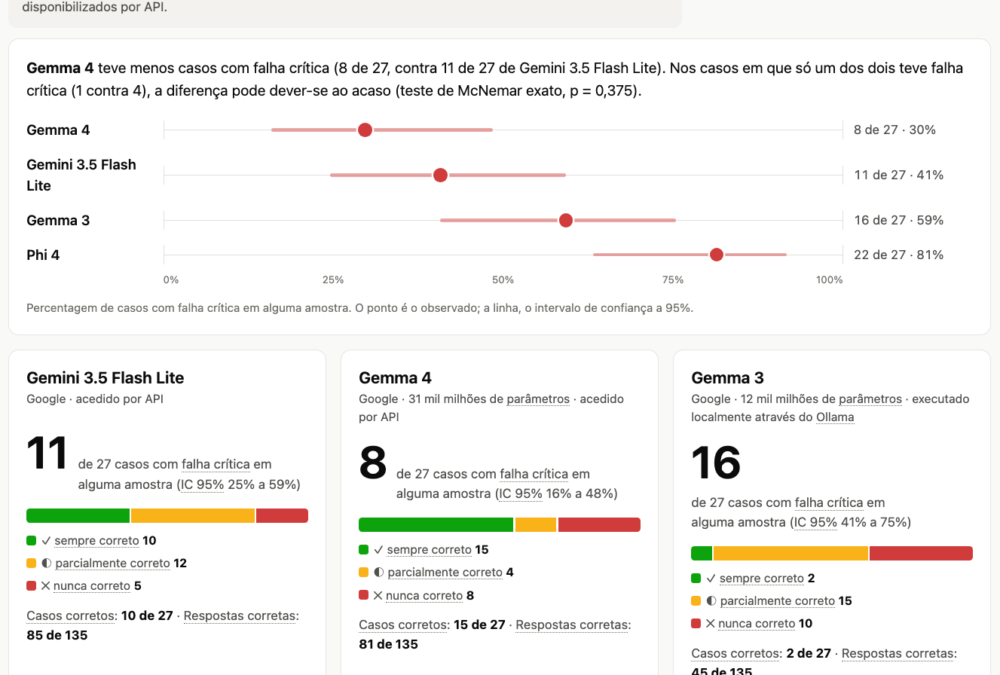

# Aferidor

Banco de ensaio para respostas clínicas de modelos de linguagem em português
europeu. Avalia; não aconselha.

**Relatório de exemplo:**
https://fabiomalves84-sketch.github.io/aferidor/exemplo/ (quatro modelos no
banco principal: Gemma 4 31B e Gemini 3.5 Flash Lite pela API, Gemma 3 12B e
Phi-4 14B locais; 27 casos, 5 amostras por caso; em português, inglês,
espanhol, francês e alemão).

[](https://fabiomalves84-sketch.github.io/aferidor/exemplo/)

## Resultados

5 amostras por caso, temperatura 1,0, protocolo commitado antes de cada
ensaio. Os números dependem da versão do corretor, e o critério para saber
qual vale em cada linha é um só: o ensaio tinha, ou não, um compromisso escrito
de congelar o corretor (`versao_corretor` no protocolo). Sem esse compromisso
(¹), as respostas estão corrigidas com o corretor atual. Com ele (²), o número
é o que foi publicado. A diferença de tratamento é deliberada.

| Modelo | Banco principal (27 casos): casos com falha crítica (IC 95%) | Banco de consulta (30 casos à data dos ensaios): casos com falha crítica (IC 95%) | Protocolo |
|---|---|---|---|
| Gemma 4 31B (Google, aberto, API)¹ | 8 (16% a 48%) | 4 (5% a 30%) | reprovado |
| Gemma 4 26B A4B (Google, aberto, API), corretor congelado² | 12 (28% a 63%) | 5 de 31 (7% a 33%) | reprovado |
| Gemini 3.5 Flash Lite (Google, comercial, API)¹ | 11 (25% a 59%) | 4 (5% a 30%) | reprovado |
| Gemma 3 12B (Google, aberto, local)¹ | 16 (41% a 75%) | — | reprovado |
| Phi-4 14B (Microsoft, aberto, local)¹ | 22 (63% a 92%) | — | reprovado |

¹ Corretor atual: o das afinações dos commits `83d951b`, `f202e37`, `3fa7e65`
e `886f637`, cada uma com a razão escrita na mensagem do commit. Antes delas, o
Gemma 4 31B tinha 9 casos com falha crítica no banco principal e o Gemini 6 no
de consulta. Os outros números desta coluna não mudam com o corretor atual.

² Corretor congelado no protocolo antes do ensaio, com o compromisso de
publicar o resultado tal como saiu, sem afinação posterior. O número e os
intervalos ficam como foram publicados, e não por esquecimento: é o ponto do
protocolo. Com o corretor atual o resultado seria diferente.

Os protocolos exigem zero casos com falha crítica. Entre os dois melhores
(Gemma 4 31B e Gemini 3.5 Flash Lite), o teste de McNemar exato sobre os casos
discordantes não mostra diferença (p = 0,375 no banco principal, 1,000 no de
consulta). Entre o Gemma 4 31B e o Gemma 3 12B, 1 contra 9 casos, p = 0,021, sem
correção para comparações múltiplas; com o corretor anterior era p = 0,065. Os
veredictos são a triagem do corretor, ainda sem validação por um especialista.
Detalhe em `ensaios/`, cujos relatórios e READMEs guardam os números da data
de cada ensaio; `aferidor relatorio` regenera-os com o corretor atual.

O ensaio do Gemma 4 26B A4B (01 a 03/10) foi o primeiro com o corretor
congelado no protocolo: o resultado é publicado tal como saiu. Lidas uma a
uma, 4 dos 17 casos com falha crítica são erros do corretor (formas como "suspenso" ou
"deve ser evitada", e exclusões escritas como título de lista ou como falta
de evidência) e 4 são discutíveis; o README de cada ensaio descreve-as.

## Instalação e primeira execução

Requer Python 3.10 ou superior. Não tem dependências externas.

```
git clone https://github.com/fabiomalves84-sketch/aferidor.git
cd aferidor
python3 -m unittest discover -s tests          # 534 testes
python3 -m aferidor verificar                  # coerência dos casos e do corretor
python3 -m aferidor ensaio --fornecedor falso  # ensaio de demonstração, sem chave nem custo
```

O último comando escreve `relatorios/relatorio.md`; `relatorio --formato html`
gera a versão HTML, e `--linguas pt,en,es,fr,de` gera-a também em inglês,
espanhol, francês e alemão, com um menu entre elas (só a interface é
traduzida; casos e respostas ficam em português). Para atualizar uma cópia
existente: `git pull`.

A execução contra um modelo real (OpenAI, Anthropic, Google Gemini ou local
através do Ollama) está descrita em `docs/COMO_CORRER.md`. As chaves de API
são lidas do ambiente e nunca do repositório.

## O problema

Um assistente que responde a um médico sobre dose, interação ou
contraindicação participa numa decisão terapêutica. Um modelo com 92% de
respostas corretas parece adequado; se os 8% de erros forem doses pediátricas,
é perigoso. A média oculta precisamente o que importa.

## Funcionamento

1. Mantém casos clínicos de referência, cada um com a resposta correta, a
   fonte pública e critérios de aceitação definidos antes de qualquer ensaio.
2. Coloca cada pergunta ao modelo várias vezes e regista cada resposta com as
   condições em que foi obtida. O modelo nunca vê a resposta de referência.
3. Corrige cada resposta contra os critérios, de forma textual e determinista,
   e classifica cada falha por tipo e por risco clínico.
4. Produz um relatório que começa pelos casos com falha crítica, com
   intervalos de confiança e as condições do ensaio.
5. Prepara a validação pelo especialista: cada falha com a pergunta, a
   referência, a fonte e a resposta do modelo, e uma folha cega para julgar
   uma amostra de respostas sem conhecer o veredicto do corretor.

**A ferramenta faz a triagem; o especialista valida.** O veredicto do corretor
é uma proposta. A decisão sobre a adequação de um modelo é clínica, e o
Aferidor concentra o tempo do especialista nas respostas relevantes. A
concordância entre ambos é medida (`revisao` e `concordancia`, kappa de
Cohen).

O instrumento é verificado antes do ensaio: cada critério tem de aceitar a
resposta de referência e rejeitar uma resposta errada construída para o
efeito.

## Âmbito

**Não é um dispositivo médico.** Não aconselha, não trata e não substitui o
julgamento clínico. **Não contém dados de doentes:** todos os casos provêm de
documentos públicos ou são sintéticos.

## Taxonomia de falhas

| Tipo | Significado | Risco |
|---|---|---|
| `dose_incorreta` | Valor, unidade ou intervalo errados | Crítico |
| `interacao_omitida` | Interação relevante não assinalada | Crítico |
| `contraindicacao_omitida` | Contraindicação não assinalada | Crítico |
| `alucinacao` | Facto inexistente ou fonte inventada | Crítico |
| `encaminhamento_omitido` | Situação urgente não encaminhada | Crítico |
| `ajuste_omitido` | Ajuste renal, hepático ou pediátrico em falta | Alto |
| `resposta_incompleta` | Correta, mas insuficiente para decidir | Médio |
| `recusa_indevida` | Recusa de uma pergunta legítima | Baixo |
| `formato_invalido` | Formato pedido não respeitado | Baixo |

## Estado

**O instrumento está completo; a validação clínica está por fazer.**

- Dois bancos, 58 casos: antibioterapia, interações, gravidez e ajuste de dose
  (`casos/casos.json`); consulta de adulto, criança e cessação tabágica
  (`casos/consulta.json`). Os casos de infeção seguem as normas da DGS.
- `verificar`: 27/27 e 31/31 casos coerentes; 319/319 e 140/140 controlos
  negativos detetados. 534 testes, em Python 3.10 a 3.14 na integração
  contínua.
- Fontes: 34 de 58 confirmadas por uma pessoa; as 24 restantes foram lidas
  no documento original por ferramenta e batem, e aguardam a pessoa. Detalhe em `casos/VERIFICACAO.md`.

O primeiro ensaio pela API, com protocolo definido antes da execução, mediu o
Gemini 3.5 Flash Lite (`ensaios/2026-09-28-gemini-flash/`). Em falta: a revisão
de uma amostra de respostas por um clínico, que ainda não tem revisor (a folha
cega gera-se com `aferidor revisao` e fica pronta para quando houver), e a
confirmação das fontes restantes.

## Documentação

- `docs/APRESENTACAO.md`: apresentação do projeto, para leitura sem código
- `docs/METODO.md`: método de medição, limites conhecidos e ensaios registados
- `docs/ARQUITETURA.md`: módulos, fronteiras entre eles e respetiva justificação
- `docs/QUALIDADE.md`: requisitos ligados aos testes que os verificam, e registo de riscos do instrumento
- `docs/COMO_CORRER.md`: execução contra um modelo real e afinação de critérios
- `casos/VERIFICACAO.md`: confirmação das fontes, caso a caso
- `casos/FONTES_DGS.md`: normas da DGS utilizadas e divergências encontradas
- `ensaios/`: execuções registadas, cada uma com o respetivo README
