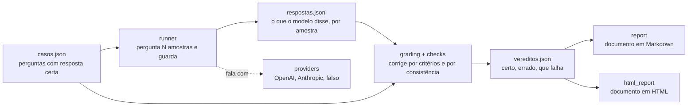

# Arquitetura

O Aferidor é uma cadeia de quatro passos, cada um num módulo próprio, e cada
fronteira entre eles existe por uma razão que se pode dizer em voz alta.

## Os módulos

| Ficheiro | Responsabilidade |
|---|---|
| `risk.py` | A taxonomia de falhas e o risco clínico de cada uma |
| `models.py` | Caso, fonte, critério, resposta (com amostra e temperatura), veredito |
| `storage.py` | Ler e escrever tudo isto em JSON legível |
| `providers.py` | Falar com um modelo, atrás de uma interface estreita |
| `runner.py` | Percorrer os casos, com repetições, retentativas e retoma |
| `checks.py` | Decidir se uma resposta cumpre um critério |
| `grading.py` | Produzir vereditos, contagens por risco e consistência entre amostras |
| `report.py` | Escrever o documento em Markdown |
| `html_report.py` | Escrever o mesmo documento em HTML, num ficheiro só |
| `cli.py` | Os comandos de terminal |

## As fronteiras que interessam

**O fornecedor nunca vê a resposta de referência.** O `runner` constrói o
texto que segue para o modelo a partir da pergunta e de mais nada. Os critérios
de aceitação e a resposta correta ficam deste lado. Um banco que mostra ao
modelo o que conta como certo não está a medir o modelo, está a medir o seu
próprio prompt. Há um teste que verifica esta fronteira diretamente.

**O corretor não é um modelo de linguagem.** É confronto de texto,
determinista e repetível. A alternativa, pôr um modelo a julgar outro, tem
dois sistemas em avaliação e nenhuma forma de saber qual deles errou. O preço
é que cada critério tem de ser escrito com cuidado, e esse preço paga-se uma
vez, quando o caso é escrito, não a cada execução.

**Os critérios são escritos antes de qualquer modelo ser executado.** Decidir
depois do facto o que conta como resposta correta é a forma mais comum de um
exercício de validação se enganar a si próprio. É também o que a ISO 13485 e o
Regulamento de Dispositivos Médicos exigem: critérios de aceitação definidos
antes do ensaio.

**As respostas são escritas à medida que chegam.** Uma execução interrompida
retoma em vez de repetir. Repetir não é só desperdício de dinheiro: a segunda
resposta do modelo à mesma pergunta é outra, e o conjunto medido deixa
silenciosamente de ser o conjunto que foi escolhido.

**Nenhuma contagem mistura modelos.** `tally` recusa vereditos de modelos
diferentes na mesma contagem, em vez de os somar. `consistency_by_model` segue
a mesma regra.

**Uma amostra sozinha não conta nada.** Um caso pode ser pedido mais do que
uma vez ao mesmo modelo; `grading.consistency_by_case` agrupa as amostras de
um caso e de um modelo e decide um de três estados, estável certo, estável
errado ou instável, a partir de quantas passaram. O número principal do
relatório deixou de ser a média de amostras corretas e passou a ser casos com
falha crítica em pelo menos uma amostra: um médico só vê uma resposta, não a
média de cinco.

**O relatório HTML não calcula nada, só apresenta o que `grading` produziu.**
`html_report.py` lê a mesma tally e a mesma estrutura de consistência que
`report.py` usa para o Markdown, e decide apenas como mostrar. É essa
fronteira, não disciplina entre dois documentos escritos à mão, que garante
que os dois formatos concordam nos números. `grading.match_answers` e
`grading.pairs_by_case` existem para os dois formatos partilharem o mesmo
emparelhamento entre resposta e veredito, em vez de cada um filtrar por si.

## Sem dependências externas

Biblioteca padrão do Python apenas, incluindo os adaptadores de HTTP. Um banco
de ensaio cujo resultado muda porque uma biblioteca de terceiros mudou entre
duas execuções não mede nada de forma repetível. O custo é algum código de HTTP
escrito à mão; o ganho é que uma execução de hoje e uma de daqui a um ano
diferem no modelo e em mais nada.

## Os dados em disco

- `casos/casos.json` escrito à mão, em português, com uma fonte por caso
- `casos/VERIFICACAO.md` a tabela de confirmação humana das fontes
- `data/respostas.jsonl` uma resposta por linha, para permitir a retoma
- `data/vereditos.json` o resultado da correção
- `relatorios/relatorio.md` o documento final em Markdown
- `relatorios/relatorio.html` o mesmo documento em HTML, quando pedido com
  `--formato html`

Os três últimos não entram no repositório. São produto de execução, não fonte.
