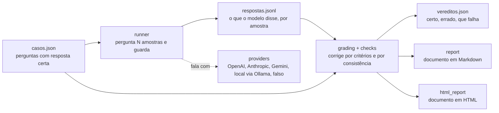

# Arquitetura

O Aferidor é uma cadeia de quatro passos, cada um num módulo próprio. Cada
fronteira entre módulos tem uma justificação explícita.

```mermaid
flowchart LR
    A[casos.json<br/>perguntas com resposta certa] --> B[runner<br/>pergunta N amostras e guarda]
    B --> C[respostas.jsonl<br/>o que o modelo disse, por amostra]
    C --> D[grading + checks<br/>corrige por critérios e por consistência]
    A --> D
    D --> E[vereditos.json<br/>certo, errado, que falha]
    D --> F[report<br/>documento em Markdown]
    D --> G[html_report<br/>documento em HTML]
    B -.fala com.-> P[providers<br/>OpenAI, Anthropic, Gemini, local via Ollama, falso]
```

## Módulos

| Ficheiro | Responsabilidade |
|---|---|
| `__init__.py` | A versão do pacote e os dois identificadores de código: `build_id` (todos os `.py`) e `grader_id` (só os seis ficheiros que decidem a correção e a aprovação) |
| `risk.py` | A taxonomia de falhas e o risco clínico de cada uma |
| `models.py` | Caso, fonte, critério, resposta (com amostra e condições de obtenção), veredicto |
| `storage.py` | Leitura e escrita destes objetos em JSON legível |
| `providers.py` | Comunicação com um modelo, através de uma interface estreita |
| `runner.py` | Execução dos casos, com repetições, novas tentativas e retoma |
| `checks.py` | Avaliação de uma resposta contra um critério |
| `grading.py` | Veredictos, contagens por risco, consistência entre amostras, controlos negativos e comparação com uma correção gravada |
| `report.py` | Relatório em Markdown |
| `condicoes.py` | O que os dois relatórios dizem do ensaio antes dos resultados: as condições em que foi feito, os casos e as amostras que não vieram, e o que o protocolo faz deles |
| `comparacao.py` | O que os números de uma comparação decidem, numa só função cada: o limiar de referência, o empate no topo, a significância (p abaixo de 0,05) e o arredondamento das percentagens; os dois relatórios usam-no, para não discordarem |
| `html_report.py` | O mesmo relatório em HTML, num único ficheiro, em oito páginas mostradas uma de cada vez só com CSS |
| `html_estilo.py` | A folha de estilo e as cores do relatório HTML, à parte do código que monta a página |
| `traducao.py` | A interface do relatório HTML em inglês, espanhol, francês e alemão; os casos e as respostas ficam em português |
| `traducao_catalogo.py` | O catálogo das cadeias da interface, uma linha por texto português com as quatro traduções; um teste falha se houver cadeias sem uso |
| `fontes.py` | De onde vêm os casos e até onde as fontes estão confirmadas: lê o `casos/VERIFICACAO.md` por ID, só para leitura; a lista dos casos confirmados um a um é conferida por teste com a tabela e com o texto do ficheiro |
| `lingua.py` | Indicador de português europeu, independente da correção clínica |
| `protocolo.py` | Critério de aprovação prévio e verificação da sua anterioridade |
| `revisao.py` | Comparação do corretor com o juízo de uma pessoa, em folha cega |
| `manifesto.py` | SHA-256 de cada ficheiro de um ensaio registado, no formato do `shasum` |
| `cli.py` | Comandos de terminal |

## Fronteiras

**O fornecedor nunca vê a resposta de referência.** O `runner` constrói o
texto enviado ao modelo apenas a partir da pergunta. Os critérios e a resposta
correta nunca saem do Aferidor; caso contrário, o ensaio mediria o próprio
prompt e não o modelo. Um teste verifica esta fronteira.

**O corretor não é um modelo de linguagem.** É confronto de texto,
determinista e repetível. Um modelo a julgar outro colocaria dois sistemas em
avaliação, sem forma de determinar qual errou. O custo é a exigência na
redação de cada critério, incorrido uma vez, quando o caso é escrito.

**Os critérios devem ser definidos antes de qualquer execução.** Definir o que
conta como resposta correta depois de ver os resultados é a forma mais comum de
enviesar uma validação. A ISO 13485 e o Regulamento de Dispositivos Médicos
exigem critérios de aceitação definidos antes do ensaio. O projeto aplica-o nos
protocolos de aprovação, que são opcionais e escritos antes do ensaio; sem
protocolo, o relatório usa o limiar de referência e diz que não é prévio. Os
critérios de cada caso e o corretor estão em código, com histórico; o corretor
foi afinado depois de alguns ensaios, e cada afinação tem a razão no commit.

**As respostas são gravadas à medida que chegam.** Uma execução interrompida
é retomada, não repetida. Repetir teria custo e alteraria a amostra: uma nova
resposta à mesma pergunta é diferente da anterior.

**Duas versões, para dois fins.** O `build_id` identifica o pacote inteiro e fica gravado em cada resposta. O `grader_id` identifica só os seis ficheiros de `GRADER_FILES` (`checks`, `grading`, `models`, `risk`, `storage` e `protocolo`) e é o que um protocolo fixa com `--congelar-correcao`: não muda com o relatório, a interface ou as traduções. Um teste cobre os seis ficheiros: o que importam tem de estar na lista, com uma única exceção declarada, `protocolo.py`, que pode importar `__init__` (para o `build_id`) e `traducao` (para redigir mensagens), porque nenhum dos dois entra na regra de aprovação. O que o `grader_id` não cobre: os critérios (dados, cobertos pelo `banco_sha256` do protocolo) e o texto do pedido (coberto pelo `prompt_sha256` de cada resposta).

**A retoma só continua a mesma medição.** Antes de qualquer pedido, o
`runner` compara as condições das respostas existentes deste modelo com as da
nova execução: temperatura, limite de tokens e texto enviado a cada caso. Se
alguma diferir, recusa e indica as opções (`--recomecar` ou outro `--saida`).
Um ficheiro com duas medições diferentes produziria um resultado que não
descreve nenhuma delas.

**Nenhuma contagem mistura modelos.** `tally` recusa veredictos de modelos
diferentes na mesma contagem; `consistency_by_model` segue a mesma regra.

**O caso, e não a amostra, é a unidade de resultado.** `grading.consistency_by_case`
agrupa as amostras de um caso e de um modelo e atribui um de três estados:
sempre correto, inconsistente ou nunca correto (as palavras são do relatório HTML, em
`_STATE_LABEL`; o estado `INSTAVEL` e a chave `casos_instaveis_max` do protocolo não mudam). `grading.case_is_right`
converte-os num veredicto binário segundo uma de três regras (`CASE_RULES`); a
mais estrita, todas as amostras corretas, é a regra por omissão, e o protocolo
pode fixar outra no campo `regra_do_caso`. O resultado principal do relatório
é o número de casos com falha crítica em pelo menos uma amostra, e não a média
de amostras corretas: na prática clínica é observada uma única resposta.

**O relatório HTML não calcula; apresenta o que `grading` produziu.**
`html_report.py` usa as mesmas contagens e a mesma estrutura de consistência
que `report.py`, e ambos leem as condições do ensaio de `condicoes.py` e as
decisões sobre os números de `comparacao.py`, pelo que os dois formatos
coincidem por construção. O relatório HTML só depende de `report.py` numa
constante, `CLINICAL_REVIEW_DONE`: os testes fazem patch nela (em `report`) para
verificar a frase da primeira página com e sem revisão, e mudá-la de módulo
deixaria esses patches sem efeito.
`grading.match_answers` e `grading.pairs_by_case` garantem que ambos usam o
mesmo emparelhamento entre resposta e veredicto.
As decisões sobre essas contagens (o limiar de referência, o empate no topo, a
significância e o arredondamento das percentagens) estão em `comparacao.py`, e os
dois formatos usam-nas.

**Só a interface muda de língua.** `traducao.py` traduz títulos, explicações,
legendas e glossário a partir de um catálogo indexado pelo texto português,
que continua a ser a fonte: o relatório em português é idêntico com ou sem
tradução. As perguntas, as referências e as respostas dos modelos são o
objeto medido e nunca são traduzidas. Cada língua é um ficheiro próprio, com
um menu entre elas, para o relatório continuar sem script e com o mesmo
peso. Um teste gera um ensaio real nas cinco línguas e exige que nenhum texto
fique sem tradução. O teste que procura cadeias sem uso lê os módulos à mão, em
`interface_strings()` (`tests/test_traducao.py`): um módulo novo com cadeias de
interface tem de ser acrescentado a essa lista, como `condicoes.py` foi.

## Sem dependências externas

Apenas a biblioteca padrão do Python, incluindo os adaptadores HTTP. Um
resultado que mude porque uma biblioteca de terceiros mudou entre execuções
não é repetível. O custo é algum código HTTP próprio; o benefício é que duas
execuções separadas no tempo diferem apenas no modelo.

## Dados em disco

- `casos/casos.json`: casos escritos à mão, em português, com fonte
- `casos/VERIFICACAO.md`: confirmação humana das fontes
- `data/respostas.jsonl`: uma resposta por linha, para permitir a retoma. Cada
  linha regista as condições de obtenção: temperatura, limite de tokens,
  SHA-256 do texto enviado e versão do Aferidor com o SHA-256 do código. Sem
  este registo, uma alteração de uma palavra no prompt seria indistinguível
  no mesmo ficheiro
- `data/vereditos.json`: resultado da correção (os relatórios não o leem: voltam a
  corrigir as respostas com os critérios atuais)
- `relatorios/relatorio.md`: relatório em Markdown
- `relatorios/relatorio.html`: relatório em HTML (`--formato html`)

Os quatro últimos não entram no repositório, por serem produto de execução.
As execuções com valor de registo são guardadas em `ensaios/`, cada uma com o
respetivo README.
